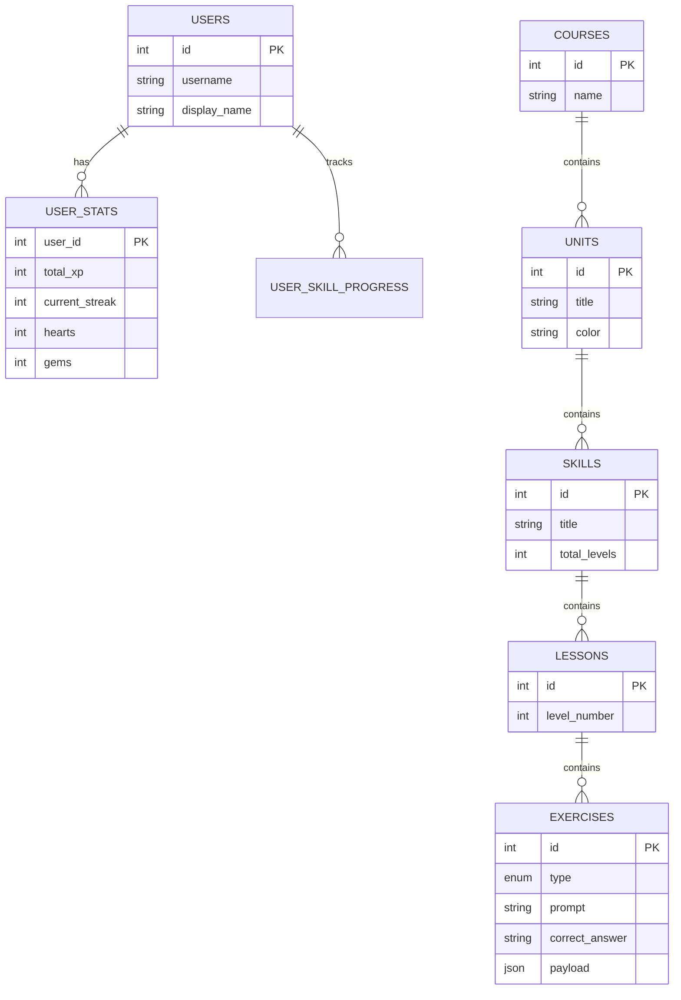

# Duolingo Clone

A full-stack, pixel-perfect clone of the Duolingo web application, built as an SDE assignment. It includes a functioning gamification engine, streak tracking, a zig-zag learning path, and five interactive lesson types.

## Tech Stack
- **Frontend**: Next.js (App Router), TypeScript, Tailwind CSS v4, Zustand, Framer Motion.
- **Backend**: FastAPI, SQLAlchemy 2.0, Pydantic v2, SQLite.
- **Deployment**: Vercel (Frontend), Render/Railway (Backend).

## Screenshots
*(Add screenshots or GIFs of the UI here)*

## Setup Instructions

### Backend
1. `cd backend`
2. `python3 -m venv venv`
3. `source venv/bin/activate`
4. `pip install -r requirements.txt`
5. `python -m app.seed.seed` (Initializes DB with user 'Alex', a course, and lessons)
6. `uvicorn app.main:app --reload`
*API will run on `http://localhost:8000`*

### Frontend
1. `cd frontend`
2. `npm install`
3. Create a `.env.local` file with `NEXT_PUBLIC_API_URL=http://localhost:8000/api/v1`
4. `npm run dev`
*App will run on `http://localhost:3000`*

## Architecture Overview
The application is structured as a monorepo. The frontend relies heavily on Zustand for global state (user profile and path tracking) and polls a versioned REST API. The backend employs a service-layer pattern to decouple business logic (streak evaluation, XP math) from the HTTP routers.

## Database Schema (ER Diagram)

**Design Rationale**: 
- We store exercise specifics (like `options` for multiple choice, or `bank` for translation) in a `payload` JSON column on the `EXERCISES` table rather than creating heavily sparse one-to-many relationship tables. This vastly simplifies querying and scaling to new exercise types without massive schema migrations.

## API Overview

| Method | Endpoint | Description |
| :--- | :--- | :--- |
| `GET` | `/api/v1/me` | Fetch active user info and stats |
| `GET` | `/api/v1/course/path` | Fetch units and skills for rendering the path |
| `GET` | `/api/v1/lessons/{id}` | Fetch lesson payload with 5 exercise types |
| `POST` | `/api/v1/exercises/{id}/check` | Validates answer, returns correct string, deducts hearts |
| `POST` | `/api/v1/lessons/{id}/complete`| Finalizes session, adds XP, evaluates day streaks |
| `POST` | `/api/v1/dev/simulate-day` | Advances time by 1 day for testing streak gap logic |

## Rules & Mechanics
- **Streak**: Increments on the first XP earned in a calendar day. Resets to 1 if the gap between the last active date and today is > 1.
- **Hearts**: Users start with 5. Every incorrect answer deducts 1 heart. At 0 hearts, progress halts until refilled (simulated button).
- **XP**: Base 10 XP per lesson + up to 10 XP bonus depending on accuracy (hearts lost).

## Assumptions
- For demonstration purposes, authentication is mocked via an injected `X-User-Id: 1` header in the API client.
- The `POST /dev/simulate-day` endpoint mutates a global offset variable rather than system time, making testing straightforward without touching OS clocks.

## Deployment Steps
1. **Backend**: Deployed to Render. Pushed Dockerfile. Uses SQLite. *Note: Since Render free tier uses an ephemeral disk, the database drops on spin-down. The `CMD` in the Dockerfile automatically runs the seed script on boot to ensure data is always present.*
2. **Frontend**: Deployed to Vercel. Bound `NEXT_PUBLIC_API_URL` to the Render URL.

## How I'd Explain This Code
- **Zustand**: Selected for global state due to minimal boilerplate compared to Redux, keeping the `LearnPage` clean when rendering the massive path structure.
- **Tailwind V4**: Utilized the modern inline `@theme` directives to strictly bind Duolingo's primary colors, ensuring no rogue generic hex codes leak into components.
- **Framer Motion**: Enabled incredibly declarative SVG manipulations for the custom Mascot component.

*(Live links: [Frontend](#), [Backend](#))*
