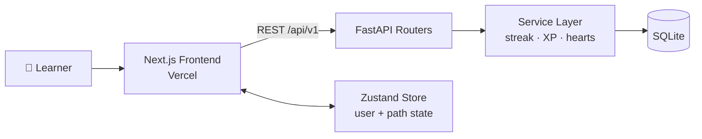

<div align="center">


# Duolingo Clone

**A full-stack, gamified language-learning app inspired by Duolingo.**
Zig-zag learning path · five interactive lesson types · streaks, XP & hearts

<br />

[](https://duolingo-clone-eight-tawny.vercel.app)
[](https://duolingoclone-backend.onrender.com/docs)


</div>

---

## 📑 Table of Contents

- [🌐 Live Demo](#-live-demo)
- [✨ Features](#-features)
- [📸 Screenshots](#-screenshots)
- [🧰 Tech Stack](#-tech-stack)
- [🚀 Getting Started](#-getting-started)
- [🏗️ Architecture](#️-architecture)
- [🗄️ Database Schema](#️-database-schema)
- [🔌 API Overview](#-api-overview)
- [🎮 Rules & Mechanics](#-rules--mechanics)
- [📝 Assumptions](#-assumptions)
- [☁️ Deployment](#️-deployment)
- [💡 How I'd Explain This Code](#-how-id-explain-this-code)

---

## 🌐 Live Demo

| Service | Link |
| :-- | :-- |
| 🖥️ **Frontend** | https://duolingo-clone-eight-tawny.vercel.app |
| ⚙️ **Backend API** | https://duolingoclone-backend.onrender.com |
| 📘 **Swagger Docs** | https://duolingoclone-backend.onrender.com/docs |

> [!NOTE]
> The backend runs on Render's free tier, which spins down after inactivity. The **first request can take 30-60 seconds** while the server wakes up and re-seeds the database. Please wait for the first load; everything is fast after that.

---

## ✨ Features

| | Feature | Description |
| :-: | :-- | :-- |
| 🗺️ | **Learning Path** | Zig-zag skill tree of units and skills with lock/unlock progression |
| 🧩 | **5 Lesson Types** | Multiple choice, word-bank translation, match pairs, fill in the blank, type the answer |
| ✅ | **Instant Feedback** | Correct/incorrect feedback bar with animated mascot reactions |
| 🔥 | **Streaks** | Daily streak tracking with testable day simulation |
| ⚡ | **XP System** | Base XP per lesson plus an accuracy bonus |
| ❤️ | **Hearts** | Lose a heart on every mistake; progress halts at zero until refilled |
| 💎 | **Gems** | Mocked currency displayed in the top bar |
| 💾 | **Persistence** | XP, streak, hearts, and skill progress are all stored per user in SQLite |

---

## 📸 Screenshots
<div align="center">

<table>
  <tr>
    <td align="center" width="50%">
      
      <br />
      <sub><b>🗺️ Learning Path</b><br/>Zig-zag skill tree with lock/unlock progression</sub>
    </td>
    <td align="center" width="50%">
      
      <br />
      <sub><b>🧩 Lesson Player</b><br/>Interactive exercises with instant feedback</sub>
    </td>
  </tr>
</table>

</div>

---

## 🧰 Tech Stack

| Layer | Technologies |
| :-- | :-- |
| 🎨 **Frontend** | Next.js (App Router), TypeScript, Tailwind CSS v4, Zustand, Framer Motion |
| ⚙️ **Backend** | FastAPI, SQLAlchemy 2.0, Pydantic v2 |
| 🗄️ **Database** | SQLite |
| ☁️ **Hosting** | Vercel (frontend), Render (backend) |

---

## 🚀 Getting Started

<details open>
<summary><b>⚙️ Backend setup</b></summary>

```bash
cd backend
python3 -m venv venv
source venv/bin/activate          # Windows: venv\Scripts\activate
pip install -r requirements.txt
python -m app.seed.seed           # seeds user "Alex", a course, and lessons
uvicorn app.main:app --reload
```

API runs at **http://localhost:8000** · Docs at **http://localhost:8000/docs**

</details>

<details open>
<summary><b>🎨 Frontend setup</b></summary>

```bash
cd frontend
npm install
echo "NEXT_PUBLIC_API_URL=http://localhost:8000/api/v1" > .env.local
npm run dev
```

App runs at **http://localhost:3000**

</details>

---

## 🏗️ Architecture



The project is a **monorepo** (`frontend/` and `backend/`). The frontend uses **Zustand** for global state (user profile and path progress) and talks to a versioned REST API. The backend follows a **service-layer pattern**, keeping business logic (streak evaluation, XP math) separate from the HTTP routers.

---

## 🗄️ Database Schema


> [!TIP]
> **Design rationale:** exercise specifics (such as `options` for multiple choice or `bank` for translation) live in a `payload` JSON column on `EXERCISES`, rather than in sparse one-to-many tables. This keeps queries simple and makes new exercise types possible without schema migrations.

---

## 🔌 API Overview

Interactive docs: [**/docs**](https://duolingoclone-backend.onrender.com/docs)

| Method | Endpoint | Description |
| :-: | :-- | :-- |
|  | `/api/v1/me` | Fetch active user info and stats |
|  | `/api/v1/course/path` | Fetch units and skills for rendering the path |
|  | `/api/v1/lessons/{id}` | Fetch a lesson with its exercises |
|  | `/api/v1/exercises/{id}/check` | Validate an answer, return the correct solution, deduct hearts |
|  | `/api/v1/lessons/{id}/complete` | Finalize the session, award XP, evaluate streak |
|  | `/api/v1/dev/simulate-day` | Advance time by one day to test streak logic |

---

## 🎮 Rules & Mechanics

| | Mechanic | Rule |
| :-: | :-- | :-- |
| 🔥 | **Streak** | Increments on the first XP earned in a calendar day. Resets to 1 if the gap since the last active day is more than 1. |
| ❤️ | **Hearts** | Users start with 5. Each wrong answer costs 1 heart. At 0, progress halts until refilled (simulated button). |
| ⚡ | **XP** | 10 base XP per lesson, plus up to 10 bonus XP depending on accuracy (hearts lost). |

---

## 📝 Assumptions

- 🔐 **Authentication is mocked.** The API client injects an `X-User-Id: 1` header, so the app always runs as the default learner "Alex".
- 🕒 **Simulated time.** `POST /dev/simulate-day` mutates a global day offset instead of the system clock, so streak logic can be tested without touching OS time.
- 💎 **Gems are mocked** and shown for display purposes.

---

## ☁️ Deployment

<details>
<summary><b>⚙️ Backend → Render</b></summary>

- Live at https://duolingoclone-backend.onrender.com
- Deployed via the project **Dockerfile**, using SQLite.
- Render's free tier has an **ephemeral disk**, so the database resets on spin-down. The Dockerfile `CMD` runs the seed script on boot, so data is always present.
- CORS is configured to allow the Vercel frontend origin.

</details>

<details>
<summary><b>🎨 Frontend → Vercel</b></summary>

- Live at https://duolingo-clone-eight-tawny.vercel.app
- Set this environment variable in the Vercel project, then redeploy:

```env
NEXT_PUBLIC_API_URL=https://duolingoclone-backend.onrender.com/api/v1
```

</details>

---

## 💡 How I'd Explain This Code

- 🐻 **Zustand:** minimal boilerplate compared to Redux, which keeps `LearnPage` clean while rendering the large path structure.
- 🎨 **Tailwind v4:** the inline `@theme` directives bind Duolingo's palette in one place, so no stray hex codes leak into components.
- 🎬 **Framer Motion:** declarative animation for the custom SVG mascot and feedback bar.
- 🧱 **Service layer:** routers stay thin; streak, XP, and hearts logic lives in services that are easy to unit-test.

---

<div align="center">

Made with 💚 for the SDE Fullstack Assignment

[🖥️ Frontend](https://duolingo-clone-eight-tawny.vercel.app) · [⚙️ Backend](https://duolingoclone-backend.onrender.com) · [📘 API Docs](https://duolingoclone-backend.onrender.com/docs)

</div>
